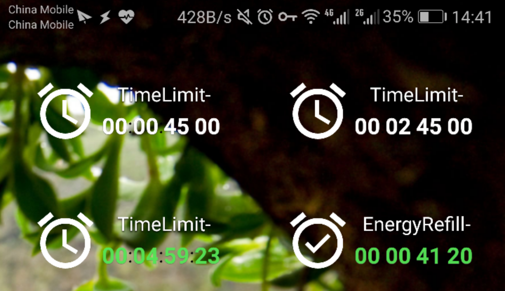
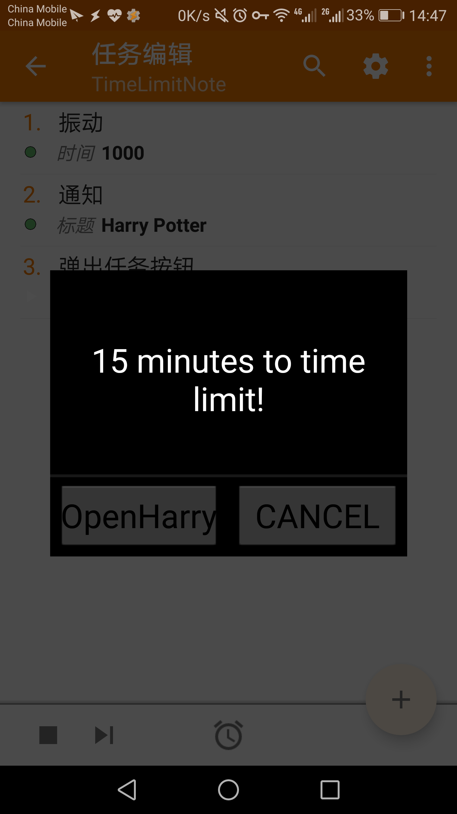
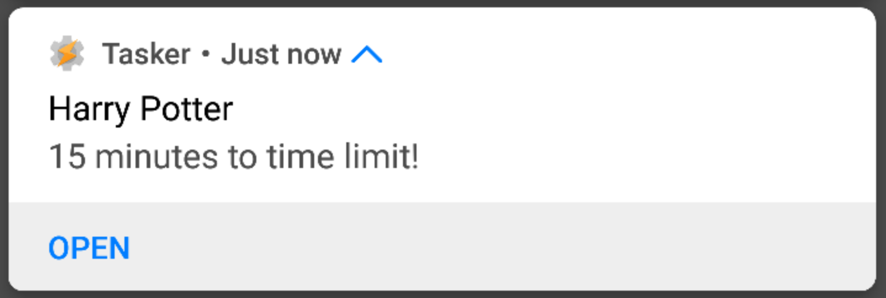
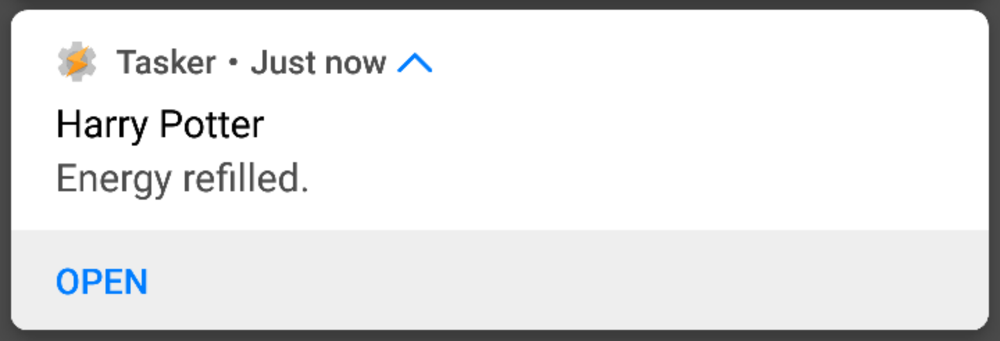

# HarryTasker - An Android Notification Solution for *Harry Potter: Hogwarts Mystery*

It might be annoying to deal with the ENERGY SYSTEM in the recent mobile game *Harry Potter: Hogwarts Mystery*. The system requires us to

1. Complete the task in a certain **time limit** (1h/3h/8h).
2. Consume **energy points** in each action of the task to earn stars. An energy point is refilled every **4 minutes** and there is a certain **energy limit** (initially 25, can be added in flying classes).

`HarryTasker` is a tool for Android users to get notifications on time. When your energy is refilled or there's 15 minutes to your time limit, you will be notified.

## Installation

1. You should get `Tasker` installed. (Available on Google Play Store.) Don't forget to allow **all permissions** for Tasker.
2. Import the `HarryPotter.prj.xml`.
3. Set desktop widgets like the following picture. Every time you exit the game, set a certain time and the system will work.

Notice that the last line should be **00:07:45:00** and **00:01:40:00** (or `4 * time_limit_minutes`). Tap the button or the number to start/stop it.

## Effect

### Time Limit

### Energy Refilled

